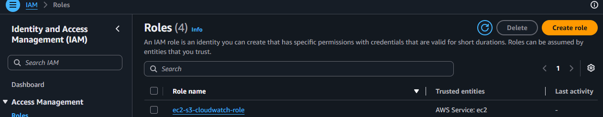
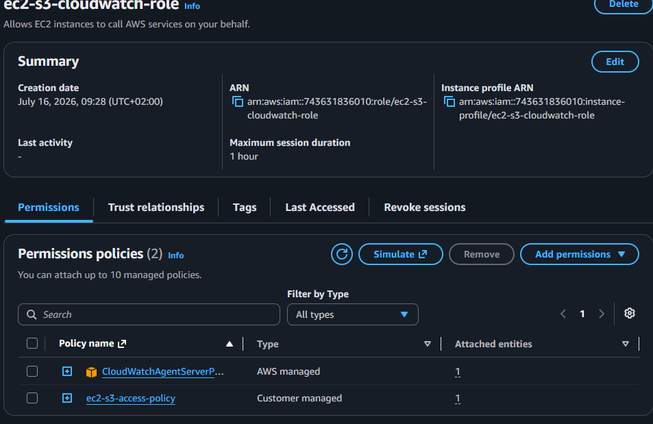
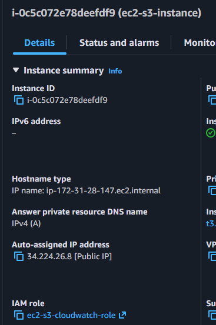
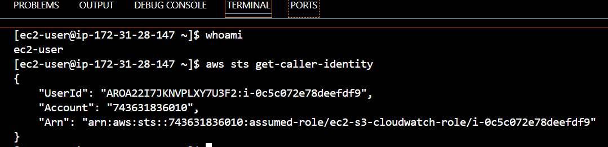
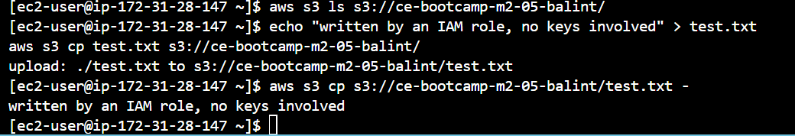

# IAM Roles for EC2 Lab - Solution

**Student Name:** Balint Lojt
**Date Completed:** 16/07/2026


  [X] Bucket created with `aws s3 mb`
- [X ] Bucket appears in `aws s3 ls`

**My bucket name:** 

ce-bootcamp-m2-05-balint
---

# Step 2 & 3: Create the Custom Policy

- [X] Policy `ec2-s3-access-policy` created from the JSON
- [X] Both `YOUR-BUCKET-NAME` placeholders replaced with my real bucket
- [X] `Resource` has **both** ARNs (bucket and objects)

### Why does the policy need two ARNs (one with `/*`, one without)?

```
_______________________________________________________________

_______________________________________________________________
```

---

# Step 4: Create the IAM Role

## Screenshot 1 – Role Creation

```
Screenshots/01-role-creation.png
```



## Screenshot 2 – Policy Attachment

```
Screenshots/02-policy-attachment.png
```



---

- [X] Role `ec2-s3-cloudwatch-role` created with **EC2** trusted entity
- [X] `CloudWatchAgentServerPolicy` attached
- [X] `ec2-s3-access-policy` attached

---

# Step 5: Attach the Role to Your Instance

## Screenshot 3 – EC2 with Role

```
screenshots/03-ec2-with-role.png
```



---

- [X] Role attached via **Actions → Security → Modify IAM role**
- [X] Instance **Details** tab shows the IAM role

---

# Step 6: Confirm No Credentials Exist on the Instance

- [X] Ran `ls -la ~/.aws/` on the instance
- [X] No `~/.aws/credentials` file present (deleted it if it existed)

---

# Step 7: Test the Role

## Screenshot 4 – Assumed-Role Identity

```
screenshots/04-assumed-role-identity.png
```



## Screenshot 5 – S3 Upload Success

```
screenshots/05-s3-upload-success.png
```



---

- [X] `aws sts get-caller-identity` shows `assumed-role/`, not `user`
- [X] `aws s3 ls s3://YOUR-BUCKET-NAME/` works
- [X] Upload (`aws s3 cp test.txt ...`) works
- [X] Read-back works
- [X] I never typed a credential

### The `Arn` from `get-caller-identity`

"Arn": "arn:aws:sts::743631836010:assumed-role/ec2-s3-cloudwatch-role/i-0c5c072e78deefdf9"


# Step 8: Test Least Privilege

## Screenshot 6 – Access Denied Proof

```
screenshots/06-access-denied-proof.png
```


---

- [ ] Listing a bucket I was not granted → `AccessDenied`
- [ ] `aws s3 rb` (delete, not granted) → `AccessDenied`

---

# Step 9: Capture the Trust Policy

- [ ] Ran `aws iam get-role ...` **from my laptop** (not the instance)
- [ ] Saved output as `trust-policy.json`
- [ ] Trust policy `Principal` is `ec2.amazonaws.com`

---

# Step 10: Locate the Source of the Credentials

- [ ] Fetched an IMDSv2 token, then read the role credentials from `169.254.169.254`
- [ ] Response includes `AccessKeyId`, `SecretAccessKey`, `Token`, and an `Expiration`

```
_______________________________________________________________
```

---

# Cleanup

- [ ] Emptied and deleted the S3 bucket (`aws s3 rb ... --force`)
- [ ] Instance **stopped** (not terminated)
- [ ] IAM role left in place (costs nothing)

---

# Submission Checklist

Repository name: `ce-lab-iam-roles-ec2` (**public**)

- [ ] `policies/s3-cloudwatch-policy.json` and `policies/trust-policy.json` committed
- [ ] `test-output/` files committed (commands, S3 test, access-denied test)
- [ ] All 6 screenshots present
- [ ] `README.md` complete with reflections
- [ ] Policy uses **both** ARN forms
- [ ] `get-caller-identity` shows `assumed-role/`
- [ ] `~/.aws/credentials` does **not** exist on the instance
- [ ] Account ID redacted (if I chose to)
- [ ] Repository URL submitted
